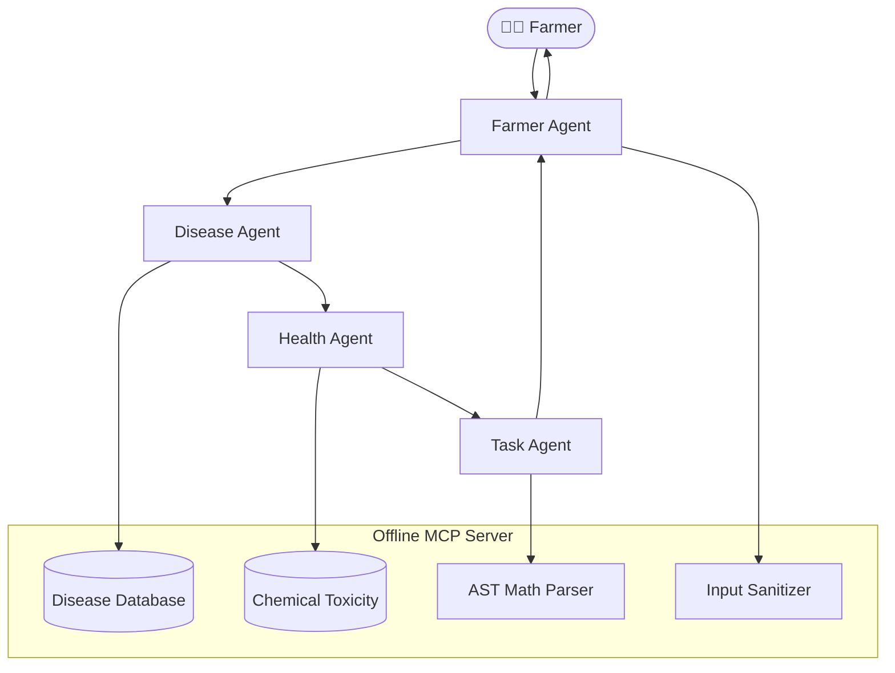

# 🛡️🌾 AgroShield

### **Offline Multi-Agent AI Decision Support System for Sustainable Agriculture**

<p align="center">


</p>

<p align="center">

**An Offline-First AI Agricultural Assistant inspired by Google's Agent Development Kit (ADK)**

Diagnose crop diseases • Assess environmental toxicity • Generate optimized field schedules • Secure mathematical dosage calculations

</p>

---

# 🌱 Overview

AgroShield is a **full-stack intelligent agricultural decision-support platform** that combines a **Multi-Agent Orchestration Graph** with an **Offline Model Context Protocol (MCP) Server** to assist farmers in diagnosing crop diseases, evaluating pesticide risks, and planning safe field operations.

Unlike cloud AI systems, **AgroShield works entirely offline**, requiring:

* ❌ No Internet
* ❌ No OpenAI API
* ❌ No Gemini API
* ❌ No Anthropic API
* ❌ No API Keys

Everything runs locally using:

* Local knowledge databases
* Rule engines
* Keyword matching
* Custom AST mathematical compiler
* Secure JSON-RPC MCP server
* 

---

# ✨ Features

## 🤖 Multi-Agent Intelligence

* 🧑‍🌾 Farmer Agent (Orchestrator)
* 🌾 Crop Disease Agent
* ☣️ Public Health Agent
* 📅 Task Optimization Agent

Each agent specializes in one domain and collectively reaches a consensus before responding.

---


## 🔌 Offline MCP Server

Supports:

✅ JSON-RPC 2.0

Communication Modes:

* Stdio
* Server Sent Events (SSE)

Available MCP Tools

| Tool                       | Description                 |
| -------------------------- | --------------------------- |
| validate_inputs            | Sanitizes incoming requests |
| detect_disease_db          | Crop disease diagnosis      |
| assess_health_implications | Toxicology evaluation       |
| execute_safe_calculation   | Safe dosage calculator      |

---

# 🏗 System Architecture

```text
              Farmer
                 │
                 ▼
        Farmer Agent (Director)
                 │
 ┌───────────────┼────────────────┐
 ▼               ▼                ▼
Disease      Health Agent     Task Agent
Agent                             │
 │                                │
 ▼                                ▼
 Disease DB                 AST Calculator
 │                                │
 └───────────────┬────────────────┘
                 ▼
          Consensus Response
```

---

# 🧠 Multi-Agent Workflow



---

# 🔒 Security First

AgroShield is designed with secure-by-default principles.

### 🛡 Input Sanitization

Blocks:

* `<script>`
* SQL Injection
* Shell Injection
* Command chaining
* XSS payloads
* Dangerous keywords

---

### 🧮 Secure AST Compiler

Instead of

```javascript
eval(expression)
```

AgroShield uses a custom implementation of:

* Tokenization
* Shunting Yard Algorithm
* Stack Evaluation

This completely prevents arbitrary code execution.

---

### 🌍 Geographic Validation

Coordinates are validated before processing.

Latitude

```
-90 → 90
```

Longitude

```
-180 → 180
```

Invalid values are rejected immediately.

---

# 📂 Project Structure

```text
Capstone Project/

├── public/
│   ├── index.html
│   ├── style.css
│   └── app.js
│
├── src/
│   ├── agents/
│   │     orchestrator.js
│   │
│   ├── mcp/
│   │     server.js
│   │     tools.js
│   │
│   └── utils/
│         safeEval.js
│
├── server.js
├── package.json
├── test-offline.js
├── .env
├── .env.example
└── README.md
```

---

# 🚀 Installation

```bash
git clone https://github.com/yourusername/AgroShield.git

cd AgroShield

npm install
```

---

# ▶ Running

Launch Express Dashboard

```bash
npm start
```

Open

```
http://localhost:3000
```

---

Run MCP Server

```bash
node server.js --stdio
```

---

# 🧪 Testing

Command Line

```bash
npm test
```

Dashboard

Click

> Run Security & Logic Tests

to execute browser-side assertions.

---

# 🎯 Tech Stack

| Layer         | Technology                |
| ------------- | ------------------------- |
| Backend       | Node.js                   |
| Frontend      | HTML CSS JavaScript       |
| Protocol      | JSON-RPC 2.0              |
| Communication | SSE + Stdio               |
| Parser        | Custom AST                |
| Scheduler     | Rule Engine               |
| Database      | Local JSON                |
| AI            | Multi-Agent Orchestration |

---

# 💡 Why AgroShield?

✔ Works without Internet

✔ Farmer-friendly

✔ Secure by Design

✔ Explainable Decisions

✔ Offline AI

✔ Environmental Safety

✔ Human Health Awareness

✔ Sustainable Agriculture

---

# 📈 Future Improvements

* 🌍 Satellite imagery support
* 📷 Plant disease image classification
* 🤖 Local LLM integration
* 🛰 Drone spraying planner
* 📡 LoRa sensor integration
* 🌦 Weather forecasting module
* 📱 Android application
* 🧪 Fertilizer optimization engine

---

# 👨‍💻 Author

**Aiman Faisal**

DataScience Student

AI • Machine Learning • Full Stack Development • Sustainable Computing

---

# ⭐ Support

If you found this project useful:

⭐ Star the repository

🍴 Fork the project

📢 Share it with others

---

<p align="center">

**"Building Offline AI for Sustainable Agriculture." 🌾**

Made with ❤️ using Node.js

</p>
